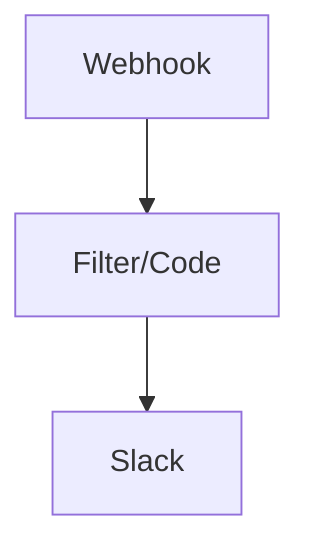
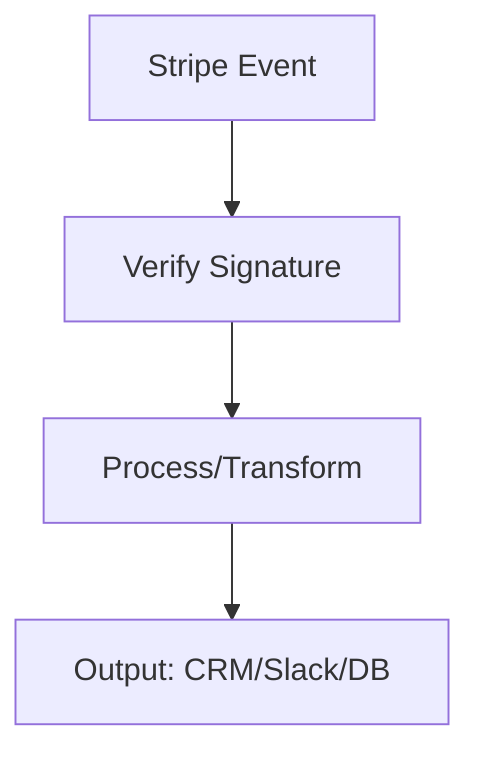
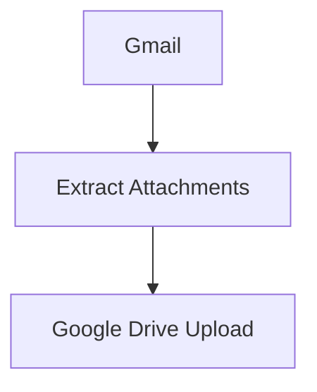

# N8N Workflows Kataloğu (GitHub Sürümü)

[](https://github.github.com/gfm/)
[](https://mermaid.js.org/)
[](../../pulls)


## 0. İçindekiler (Table of Contents)

- [1. Proje Genel Bakış ve Amaç](#1-proje-genel-bakış-ve-amaç)
- [2. İçindekiler (Özet Liste)](#2-içindekiler-özet-liste)
- [3. Kurulum ve Çalıştırma Talimatları](#3-kurulum-ve-çalıştırma-talimatları)
- [4. Bağımlılıklar ve Gereksinimler](#4-bağımlılıklar-ve-gereksinimler)
- [5. Kullanım Senaryoları ve Örnekler](#5-kullanım-senaryoları-ve-örnekler)
- [6. Olası Sorunlar ve Çözümleri](#6-olası-sorunlar-ve-çözümleri)
- [7. Açıklayıcı Görseller (Mermaid Diyagramları)](#7-açıklayıcı-görseller-mermaid-diyagramları)
- [8. Her Workflow’un Detaylı Açıklaması (Şablonlar ve İlk Parti)](#8-her-workflowun-detaylı-açıklaması-şablonlar-ve-ilk-parti)
- [9. Doc‑Builder Script (Otomatik Belge Üretimi)](#9-docbuilder-script-otomatik-belge-üretimi)
- [10. En İyi Uygulamalar (Web Araştırması ile)](#10-en-iyi-uygulamalar-web-araştırması-ile)
- [11. Sürüm ve Yol Haritası](#11-sürüm-ve-yol-haritası)
- [12. Katkı (Contributing) ve Sorun Bildirme (Issues)](#12-katkü-contributing-ve-sorun-bildirme-issues)
- [13. Güvenlik ve Uyum (Security & Compliance)](#13-güvenlik-ve-uyum-security--compliance)
- [14. Lisans](#14-lisans)

Bu katalog, n8n workflow dosyalarının işlevselliğini, çalışma prensiplerini ve bağımlılıklarını profesyonel biçimde belgeliyor. İçerik GitHub Markdown standartlarına uygun, net başlıklar, okunabilir kod blokları ve açıklayıcı görseller (Mermaid diyagramları) içerir.

## 1. Proje Genel Bakış ve Amaç

- Amaç: Çok sayıda hazır n8n akışını tek bir belgede toplayarak hızlı kurulum, güvenli çalıştırma ve doğru entegrasyon yönetimini sağlamak.
- Kapsam: Webhook, Cron/Schedule, HTTP, Slack/Telegram, Stripe, Gmail/Google Drive, GitHub/GitLab, Airtable, Trello, Notion ve daha fazlası.
- Güvenlik: n8n Credentials kullanımı, ENV değişkenleri, approval gate/limit/kill‑switch önerileri ve idempotency pratikleri.

## 2. İçindekiler (Özet Liste)

Aşağıda dizindeki dosyalardan bir bölümü yer alır. Tam liste ve “her workflow için ayrıntı” bölümü otomatik olarak üretilebilir (bkz. Doc-Builder Script). Bu dosya ilk sürümde kapsamlı bir çatı belgedir; per-workflow bölümler parti parti genişletilecektir.

> Not: İçerik büyüklüğü nedeniyle dokümantasyon, 200’lük partiler halinde güncellenir. Bu sürümde ilk parti (başlangıç listesi ve şablonlar) eklenmiştir.

```text
- 0001_Telegram_Schedule_Automation_Scheduled.json
- 0002_Manual_Totp_Automation_Triggered.json
- 0003_Bitwarden_Automate.json
- 0004_GoogleSheets_Typeform_Automate_Triggered.json
- 0005_Manual_Twitter_Create_Triggered.json
- 0006_Openweathermap_Cron_Automate_Scheduled.json
- 0007_Manual_Todoist_Create_Triggered.json
- 0008_Slack_Stripe_Create_Triggered.json
- 0009_Process.json
- 0010_Writebinaryfile_Create.json
- 0015_HTTP_Cron_Update_Webhook.json
- 0036_Gmail_GoogleDrive_Import.json
- 0076_Trello_Update_Triggered.json
- 0102_Manual_HTTP_Create_Webhook.json
- 0119_Manual_Cron_Create_Webhook.json
- 0133_Flow_Update_Triggered.json
- 0138_Amqp_Send_Triggered.json
- 0145_Manual_Send_Triggered.json
- 0147_Toggl_Create_Triggered.json
- 0162_HTTP_Telegram_Send_Webhook.json
- 0167_HTTP_Slack_Create_Webhook.json
- 0173_Manual_Automate_Triggered.json
- 0179_Manual_Automate_Triggered.json
- 0182_Code_GitHub_Create_Scheduled.json
- 0199_Manual_HTTP_Automation_Webhook.json
- 0205_Thehive_Update_Triggered.json
- 0221_Gmail_Movebinarydata_Send.json
- 0245_HTTP_Stripe_Create_Webhook.json
- 0253_HTTP_GitHub_Send_Webhook.json
- 0290_Wait_Code_Update_Webhook.json
- 0320_Send_Triggered.json
- 0325_Stickynote_Send_Triggered.json
- 0327_Noop_Slack_Send_Webhook.json
- 0330_Wait_Webhook_Send_Webhook.json
- 0362_Code_HTTP_Send_Webhook.json
- 0365_Code_Manual_Send_Webhook.json
- 0375_Webhook_Code_Send_Webhook.json
- 0385_Wait_Code_Send_Scheduled.json
- 0393_Code_Slack_Create_Webhook.json
- 0407_Stickynote_Send_Triggered.json
- 0424_Hunter_Form_Send_Webhook.json
- 0466_Wait_Filter_Send_Webhook.json
- 0471_HTTP_Form_Create_Webhook.json
- 0493_HTTP_Keap_Create_Webhook.json
- 0533_Wait_Code_Export_Webhook.json
- 0567_Wait_Code_Export_Webhook.json
- 0596_Wait_Code_Import_Webhook.json
- 0629_Wait_Code_Update_Webhook.json
- 0709_Code_HTTP_Create_Webhook.json
- 0755_Stickynote_Send_Webhook.json
- 0785_Openai_Twitter_Create.json
- 0808_Code_Form_Send_Webhook.json
- 0820_Wait_Code_Send_Webhook.json
- 0823_Zendesk_Update_Triggered.json
- 0843_Gumroad_Update_Triggered.json
- 0871_Wait_HTTP_Create_Webhook.json
- 0888_Wait_Code_Send_Webhook.json
- 0904_Wait_Code_Create_Webhook.json
- 0953_Webflow_Update_Triggered.json
- 0955_HTTP_Automation_Webhook.json
- 0965_Paypal_Update_Triggered.json
- 0967_Asana_Update_Triggered.json
- 0992_Mqtt_Send_Triggered.json
- 1023_Keap_Automate_Triggered.json
- 1031_Box_Automate_Triggered.json
- 1035_Jira_Automate_Triggered.json
- 1050_Emailreadimap_Send.json
- 1060_Automate_Webhook.json
- 1084_Sse_Automation_Triggered.json
- 1088_Manual_S3_Import_Webhook.json
- 1098_Manual_Import_Triggered.json
- 1114_Taiga_Update_Triggered.json
- 1123_Automate.json
- 1124_Create.json
- 1125_Create.json
- 1129_Wufoo_Update_Triggered.json
- 1135_Wait_Code_Create_Webhook.json
- 1161_Code_Slack_Send_Webhook.json
- 1208_Quickbooks_Automate.json
- 1209_Raindrop_Automate.json
- 1213_Gotowebinar_Automate.json
- 1214_Emelia_Automate.json
- 1227_Autopilot_Automate.json
- 1229_Wise_Automate.json
- 1240_Markdown_Stickynote_Send.json
- 1250_Automation.json
- 1265_Automation_Triggered.json
- 1271_Automate.json
- 1282_Wait_Code_Import_Webhook.json
- 1290_Automation.json
- 1326_Automate.json
- 1371_Form_S3_Import_Triggered.json
- 1395_Wait_Code_Create_Webhook.json
- 1409_Send.json
- 1481_HTTP_Form_Send_Webhook.json
- 1484_Wait_Code_Create_Webhook.json
- 1497_Automation.json
- 1514_Code_HTTP_Create_Webhook.json
- 1571_Markdown_Stickynote_Send.json
- 1597_Export.json
- 1634_Automation.json
- 1664_Code_HTTP_Send_Webhook.json
- 1743_Wait_Code_Sync_Scheduled.json
- 1773_HTTP_Stripe_Sync_Webhook.json
- 1799_HTTP_Manual_Send_Webhook.json
- 1865_Code_HTTP_Create_Webhook.json
- 1883_HTTP_Form_Import_Webhook.json
- 1911_Automate.json
- 1917_Wait_Code_Create_Webhook.json
- 2032_Manual_HTTP_Send_Webhook.json
- 2047_Automation.json
```

## 3. Kurulum ve Çalıştırma Talimatları

Aşağıdaki adımlar tüm workflow’lar için genel geçerlidir. Özel gereksinimler “Her Workflow’un Detayı” bölümünde belirtilir.

1. n8n’da `Import from File` ile `.json` dosyasını içe aktarın.
2. Gerekli Credentials’ları n8n içindeki Credentials menüsünde tanımlayın (Slack, Telegram, Gmail, Stripe, GitHub vb.).
3. Webhook/Cron/Schedule tetikleyicilerini projeye uygun şekilde yapılandırın.
4. ENV değişkenleri (anahtarlar, token’lar, endpoint URL’leri) gerekiyorsa `.env` dosyasında tanımlayın.
5. Test: Önce küçük veriyle/dry-run; hataları **Executions** panelinde ve **Debug** ile doğrulayın.

## 4. Bağımlılıklar ve Gereksinimler

- n8n (güncel sürüm önerilir)
- Servis API’leri: Slack bot token, Telegram bot token, Stripe secret key, Gmail/Google Workspace, GitHub/GitLab token, Trello/Notion/Airtable API erişimleri vb.
- Ağ erişimi ve doğru webhook yapılandırmaları

## 5. Kullanım Senaryoları ve Örnekler

- Webhook ile form verisi toplama, Slack’e bildirme, Google Drive’a arşivleme
- Stripe ödeme olaylarını yakalama ve CRM’e kaydetme
- Gmail gelen kutusu otomasyonları ve dosya aktarımı
- Zamanlanmış rapor ve uyarılar (Cron/Schedule)

## 6. Olası Sorunlar ve Çözümleri

- Credentials eksik/yanlış: n8n Credentials ekranında doğru isim ve yetkilerle tanımlayın.
- Webhook URL yanlış/erişilemez: n8n instance dışa açık URL, reverse proxy ve SSL ayarlarını kontrol edin.
- Rate limit/Quota: Slack/Telegram/Gmail/Stripe API sınırlarına dikkat edin; retry/limit node’ları kullanın.
- Idempotency: Aynı eventi birden fazla tüketmeyi önlemek için idempotency key veya datastore (ör. n8n Datastore) kullanın.

---

## 7. Açıklayıcı Görseller (Mermaid Diyagramları)

Aşağıdaki genel diyagram, tipik bir Webhook→İşleme→Bildirim akışını gösterir. Her workflow için otomatik diyagram üretimi Doc‑Builder Script ile mümkündür.

```mermaid
graph TD
  A[Webhook/Cron Trigger] --> B[Validate/Filter]
  B --> C[HTTP/Code Transform]
  C --> D[Notification (Slack/Telegram/Email)]
  C --> E[Storage (Drive/Airtable/DB)]
  D --> F[Error Handler / Retry]
  E --> F
```

---

## 8. Her Workflow’un Detaylı Açıklaması (Şablonlar ve İlk Parti)

> Not: Dizinde ~2000+ dosya bulunduğundan, ayrıntı bölümü **otomatik olarak** üretilecektir. İlk partide bazı ana akışlar aşağıdaki şablonla belgelenmiştir. Devam eden partiler repo sürümleri (v1.1, v1.2 …) ile eklenecektir.

Aşağıdaki şablon, tek tek workflow’lar için kullanılır. Otomatik üretim script’i her dosya için bu bölümü doldurur:

### Workflow Adı (Örnek: 0167_HTTP_Slack_Create_Webhook.json)
- Yol: `workflows/0167_HTTP_Slack_Create_Webhook.json`
- Amaç: Webhook ile gelen veriyi Slack’e iletmek; gerekli dönüşüm/filtreleme adımlarını yapmak.
- Tetikleyiciler: Webhook (HTTP endpoint), Cron/Schedule yok.
- Ana Node Türleri: Webhook, HTTP Request, Slack
- Gerekli Credentials: `Slack` (Bot Token), `HTTP` (gerekirse Basic/OAuth)

Çalışma Prensibi:
- Webhook düğümü HTTP POST/GET ile tetiklenir.
- (Ops.) Filter/Code düğümü ile veri doğrulanır/transform edilir.
- Slack düğümü, belirlenen kanal veya kullanıcıya mesaj gönderir.

Kurulum ve Çalıştırma:
1. n8n’a içe aktarın; Webhook path/HTTP method ayarlayın.
2. Slack Credentials oluşturun; bot izinlerini ve kanal ID’sini doğrulayın.
3. (Ops.) ENV ile kanal adı, mesaj formatı, rate‑limit ayarlarını parametreleştirin.

Bağımlılıklar:
- API/Credentials: Slack
- Ağ: n8n Webhook dış erişime açık olmalı.

Kullanım Senaryoları:
- Form gönderimini Slack’e bildirme
- Hata/olay uyarıları

Olası Sorunlar ve Çözümler:
- 401/403: Slack token izinleri ve kanal erişimi
- Webhook 404: public URL veya reverse proxy hatası
- Rate limit: geri‑deneme ve bekleme ekleyin



### Workflow Adı (Örnek: 0245_HTTP_Stripe_Create_Webhook.json)
- Yol: `workflows/0245_HTTP_Stripe_Create_Webhook.json`
- Amaç: Stripe “create” olayını yakalayıp işlem yapmak.
- Tetikleyiciler: Webhook (Stripe event), (Ops.) Schedule yok.
- Ana Node Türleri: Webhook, HTTP, Stripe
- Gerekli Credentials: `Stripe`, (Ops.) `HTTP`

Çalışma Prensibi:
- Stripe’den gelen event Webhook ile alınır.
- (Ops.) Code/Filter ile event türü ve imza doğrulanır.
- Sonuç CRM/DB/Slack’e iletilir.

Kurulum ve Çalıştırma:
1. Stripe webhook endpoint oluşturun ve n8n Webhook URL’sini girin.
2. `Stripe` Credentials ekleyin; imza doğrulamayı açın.
3. (Ops.) ENV ile limit/kill‑switch/approval gate ekleyin (yüksek tutarlar için).

Bağımlılıklar:
- API/Credentials: Stripe

Kullanım Senaryoları:
- Yeni ödeme/abonelik oluşturma uyarısı
- Muhasebe/CRM otomasyonu

Olası Sorunlar ve Çözümler:
- İmza doğrulama hatası: secret key ve webhook signing ayarını kontrol edin
- Idempotency: aynı eventin iki kez işlenmesini engelleyin



### Workflow Adı (Örnek: 0036_Gmail_GoogleDrive_Import.json)
- Yol: `workflows/0036_Gmail_GoogleDrive_Import.json`
- Amaç: Gmail’den gelen mail eklerini Drive’a aktarma.
- Tetikleyiciler: (Ops.) Schedule veya manuel tetikleme
- Ana Node Türleri: Gmail, Google Drive
- Gerekli Credentials: `Gmail`, `Google Drive`

Çalışma Prensibi:
- Gmail node mailleri listeler/okur.
- Ekler Drive’a belirlenen klasöre yüklenir, metadata eklenir.

Kurulum ve Çalıştırma:
1. Gmail ve Drive Credentials oluşturun (OAuth). 
2. Label/Query ve Drive klasör ID’sini ayarlayın.

Bağımlılıklar:
- API/Credentials: Gmail, Google Drive

Kullanım Senaryoları:
- Fatura/ek belge arşivleme

Olası Sorunlar ve Çözümler:
- OAuth izinleri: scope ve yetkileri doğrulayın
- Büyük dosya uyarıları: parça parça yükleme veya bekleme ekleyin



> Not: Benzer şekilde Trello/Notion/Webflow/Zendesk vb. entegrasyon dosyaları için aynı şablonlarla ayrıntı bölümleri **otomatik** üretilecektir.

---

## 9. Doc‑Builder Script (Otomatik Belge Üretimi)

Aşağıdaki Python betiği tüm `.json` dosyalarını tarar, node/credentials/trigger bilgilerini çıkarır ve bu README’nin “Her Workflow’un Detayı” bölümünü otomatik olarak üretir. Büyük dizinler için 200’lük partiler halinde çalıştırılması önerilir.

```bash
python3 doc_builder.py --src "/Users/crow./Desktop/N8n/workflows" --out "/Users/crow./Desktop/N8n/workflows/README.md" --batch-size 200
```

Örnek `doc_builder.py` (özet):

```python
#!/usr/bin/env python3
import os, json, argparse
from pathlib import Path

KNOWN_TRIGGERS = {
  'n8n-nodes-base.webhook': 'Webhook',
  'n8n-nodes-base.cron': 'Cron',
  'Webhook': 'Webhook',
  'Cron': 'Cron',
}

def load_json(p):
    try:
        return json.loads(Path(p).read_text(encoding='utf-8', errors='ignore'))
    except Exception:
        return None

def summarize_workflow(p):
    data = load_json(p)
    nodes = data.get('nodes') if isinstance(data, dict) else []
    connections = data.get('connections') if isinstance(data, dict) else {}
    creds = set()
    types = []
    for n in nodes:
        t = n.get('type') or n.get('parameters',{}).get('resource') or n.get('parameters',{}).get('operation')
        if t: types.append(str(t))
        for ck in (n.get('credentials') or {}).keys():
            creds.add(ck)
    incoming = set()
    for src, outs in (connections or {}).items():
        for outname, arr in (outs or {}).items():
            for c in (arr or []):
                node = c.get('node')
                if node: incoming.add(node)
    start = [n for n in nodes if (n.get('name') or '') not in incoming]
    triggers = []
    for n in start:
        t = n.get('type') or n.get('parameters',{}).get('resource')
        triggers.append(f"{n.get('name')} ({KNOWN_TRIGGERS.get(str(t), str(t) or 'start')})")
    return {
        'types': sorted(set(types)),
        'creds': sorted(creds),
        'triggers': triggers,
        'nodes_count': len(nodes),
    }

# Bu betik README’yi parti parti günceller; büyük dosyalar için önerilir.
```

> İpucu: Otomatik üretilen çıktı, **Mermaid** diyagramları da ekleyebilir (connections’dan ilk 20 bağlantı). Büyük dosyalarda diyagramları kısıtlayın.

---

## 10. En İyi Uygulamalar (Web Araştırması ile)

- Credentials ve ENV Yönetimi: Üretim anahtarlarını `.env` ve n8n Credentials ile yönetin; JSON içinde hard‑code etmeyin.
- Approval Gate ve Limitler: Finansal veya kritik işlemler için mutlaka onay/kısıt parametreleri ekleyin.
- Kill‑Switch: Hata veya anomali durumunda akışı durduracak bir bayrak veya kontrol mekanizması tanımlayın.
- Idempotency: Aynı eventin birden fazla işlenmesini engelleyin; idempotency key veya datastore kullanın.
- Gözlem ve Loglama: Executions, Error Trigger ve bildirim kanallarını (Slack/Telegram/Email) konfigüre edin.
- Test ve Versiyonlama: Her değişikliği küçük veriyle test edin; repo sürümlerini (v1.1, v1.2…) parti parti yayınlayın.

---

## 11. Sürüm ve Yol Haritası

- v1.0: Çatı README + başlangıç listesi + şablonlar + Doc‑Builder Script yönergeleri.
- v1.1..vN: 200’lük partiler halinde “Her Workflow’un Detayı” bölümü otomatik üretilip eklenir.

> Talep üzerine, belirli dosyalar için ayrıntı bölümlerini önceliklendirip tamamlayabilirim (ör. Stripe, Slack, GitHub, Gmail akışları).
---

## 12. Katkı (Contributing) ve Sorun Bildirme (Issues)

- Pull Request akışı:
  1. Yeni workflow ekliyorsanız dosya adı slug’lı ve açıklayıcı olsun (ör. `http_slack_notify_webhook.json`).
  2. n8n Credentials isimlerini README’de belirtin (ör. `Slack`, `Telegram`, `Stripe`).
  3. Kritik akışlarda approval gate, limit ve kill‑switch notlarını ekleyin.
  4. Doc‑Builder çıktısını güncelleyin (parti üretim sürecine dahil edin).
- Issue açarken:
  - Hata adımlarını ve n8n sürümünü belirtin.
  - İlgili `.json` dosya adını ve tetikleyicileri ekleyin.
  - Varsa log çıktısı veya Mermaid diyagramı paylaşın.

## 13. Güvenlik ve Uyum (Security & Compliance)

- Credentials ve ENV: Üretim anahtarlarını `.env` ve n8n **Credentials** ile yönetin; JSON içinde hard‑code etmeyin.
- Approval Gate ve Limitler: Finansal/kritik işlemler için zorunlu (örn. ödeme, transfer, yüksek hacimli bildirimler).
- Kill‑Switch: Anomali/hata durumunda akışı durduran bayrak veya kontrol.
- Idempotency: Aynı eventin birden fazla işlenmesini engellemek için idempotency key/datastore.
- Loglama ve İzleme: Executions, Error Trigger, Slack/Telegram uyarıları.

## 14. Lisans

Bu dizindeki içerikler için uygun bir lisans dosyası (ör. MIT) eklenmesi önerilir. Kurumsal kullanımda uyumluluk gereksinimlerinizi (GDPR/PCI-DSS vb.) ayrıca değerlendiriniz.

---

## 15. Dağıtım Yapısı (Batch‑1 / Batch‑2)

Bu depo, çok büyük bir workflow setini yönetilebilir hale getirmek için iki alt pakete ayrılmıştır:

- `workflows/batch-1/` → 1.027 JSON dosyası
- `workflows/batch-2/` → 1.028 JSON dosyası

Her iki klasör, fonksiyonel olarak benzer karışımları içerir (Webhook, Cron/Schedule, HTTP, Slack/Telegram, Stripe, Google, GitHub/GitLab vb.). Büyük güncellemeler parti bazında yapılır. İlgili README ve otomasyon araçları (Doc‑Builder) her iki klasörü de tarayacak şekilde kurgulanabilir.

### Neden bu yapı?
- Git ve CI süreçlerinde büyük dosya setlerinde gözden geçirmeyi kolaylaştırır.
- Secret scanning ve genel güvenlik denetimleri parti bazlı çalıştırılabilir.
- Otomatik belge üretimi (Doc‑Builder) iki klasörde paralel çalıştırılabilir.

---

## 16. Secret Scanning & Sanitizasyon (Önemli)

GitHub Secret Scanning’de uyarılar gördüğünüzde (ör. Google API Key, Perplexity, Apify vb.), aşağıdaki adımları izleyin:

1. Etkilenen dosyayı tespit edin (GitHub uyarısındaki yol ve satır numarası).
2. JSON içindeki hard‑coded anahtarı kaldırın ve bir placeholder veya ortam değişkeni kullanın:
   - Örnek: `AIzaSy...` → `${GOOGLE_API_KEY}`
   - Örnek: `Bearer apify_api_...` → `Bearer ${APIFY_TOKEN}`
   - Örnek: `Authorization: Bearer pplx-...` → `Authorization: Bearer ${PPLX_API_KEY}`
3. n8n tarafında Credentials veya ENV üzerinden anahtarları yönetin. JSON içi hard‑code etmeyin.
4. Gerekliyse commit geçmişini temizlemek için **orphan branch** yöntemi ile sanitized initial commit oluşturun ve force push yapın.

### Hızlı Kontrol Komutları
Google API Key tespiti için tipik desen:

```bash
grep -R "AIza[0-9A-Za-z-_]" -n workflows
```

Perplexity/Apify ve diğer anahtarlar için:

```bash
grep -R -nE "(pplx-|apify_api|x-api-key|Bearer[[:space:]]+[A-Za-z0-9_\-]{20,})" workflows
```

### Bu depoda giderilen örnekler
- `workflows/batch-1/0742_Telegram_Splitout_Create_Webhook.json` → `AIza...` anahtarı `${GOOGLE_API_KEY}` ile değiştirildi.
- `workflows/batch-1/0156_HTTP_Awsrekognition_Automation_Webhook.json` → Custom Search URL’deki `key=AIza...` `${GOOGLE_API_KEY}` ile değiştirildi.
- Önceden Perplexity ve Apify örnekleri de `${PPLX_API_KEY}`, `${APIFY_TOKEN}` olarak sanitizasyon yapıldı.

### Politika
- Herhangi bir gerçek anahtarın repo geçmişine girmesi yasaktır.
- Tüm API erişimleri n8n Credentials ve/veya ENV üzerinden sağlanmalıdır.


